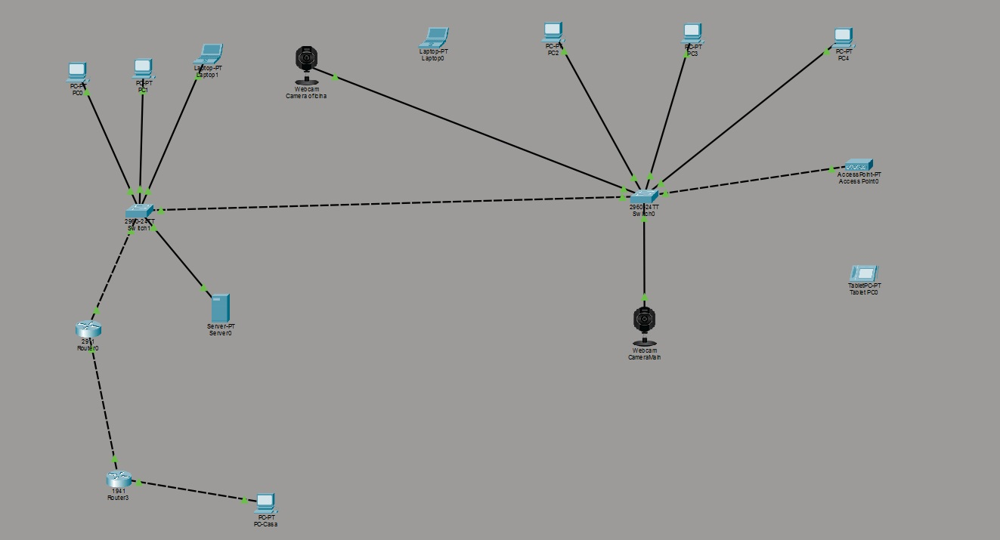

# 🛡️ Secure Enterprise Network Architecture

**Project:** Implementation of a Hardened Layer 2/3 Infrastructure with Site-to-Site VPN.
**Author:** Punga
**Tools:** Cisco Packet Tracer 8.x


---

## 📋 Project Overview
This project simulates a corporate network environment designed with a **"Security-First" mindset**. The topology connects a Headquarters (HQ) LAN to a Remote Branch via a simulated WAN, ensuring confidentiality, integrity, and availability through rigorous configuration.

The objective was to harden the network against common attacks (Spoofing, MITM, Unauthorized Access) and establish secure communications over public infrastructure using industry standards.

## 🏗️ Network Topology

*(Note: This topology highlights the HQ Site, WAN link, and Remote Branch)*

**Key Components:**
* **HQ Site:** Cisco 2911 Router, Layer 2 Switches, AAA/Syslog Server.
* **Remote Site:** Cisco 1941 Router (Branch Office).
* **WAN:** Simulated Internet backbone.

---

## 🔒 Key Technologies Implemented

### 1. Identity & Access Management (AAA)
Migrated from local database management to a centralized **TACACS+** architecture.
* **Authentication:** Centralized user verification via Server0.
* **Authorization:** Granular command control.
* **Accounting:** All changes are logged for auditing.
* **Resilience:** Configured local database fallback in case of server failure.

### 2. Layer 2 Defense (Hardening)
Implemented controls to mitigate LAN-based attacks:
* **DHCP Snooping:** Configured trusted/untrusted ports to block Rogue DHCP Servers and prevent Man-in-the-Middle (MITM) attacks.
* **Dynamic ARP Inspection (DAI):** Validates ARP packets against the DHCP binding database to prevent ARP Poisoning/Spoofing.
* **Port Security:** Restricted MAC addresses per port to prevent flooding and unauthorized device connections.

### 3. Secure Transport (Site-to-Site VPN)
Established an **IPsec VPN Tunnel** to connect the HQ and Remote Site securely.
* **Protocol:** IKEv1 (ISAKMP).
* **Encryption:** AES-128.
* **Hashing:** SHA-1.
* **Authentication:** Pre-Shared Key (PSK).
* **Status:** Validated `QM_IDLE` state and encrypted ICMP traffic flow.

### 4. Infrastructure Services
* **VLANs:** Traffic segmentation (Data, Voice, Management).
* **NTP:** Time synchronization for accurate log analysis.
* **Syslog:** Centralized logging for forensics.

---

## ⚙️ Configuration Highlights

### A. Site-to-Site VPN (IPsec)
*Configuration snippet for the encryption tunnel:*

```cisco
! Phase 1 Policy (ISAKMP)
crypto isakmp policy 10
 encr aes
 authentication pre-share
 group 2
 hash sha

! Phase 2 (Transform Set & Map)
crypto ipsec transform-set SET-VPN esp-aes esp-sha-hmac
crypto map MAPA-VPN 10 ipsec-isakmp
 set peer 200.200.200.2
 set transform-set SET-VPN
 match address 110
```

## ✅ Verification & Troubleshooting

During deployment, connectivity issues were resolved using Cisco IOS debugging tools (`debug crypto isakmp` and `show ip dhcp snooping binding`).

**VPN Success Evidence:**
The following output confirms the tunnel is active and protecting data:

```text
Router# show crypto isakmp sa
IPv4 Crypto ISAKMP SA
dst             src             state          conn-id slot status
200.200.200.2   200.200.200.1   QM_IDLE           1020    0 ACTIVE
```

## 🚀 How to Run
1.  Download **Cisco Packet Tracer** (Version 8.0 or newer).
2.  Clone this repository.
3.  Open the `.pkt` file.
4.  Allow time for STP convergence (Green lights).
5.  Test connectivity by Pinging from `PC0` (HQ) to `PC-Casa` (Remote). The first few packets may fail due to ARP/VPN negotiation.
